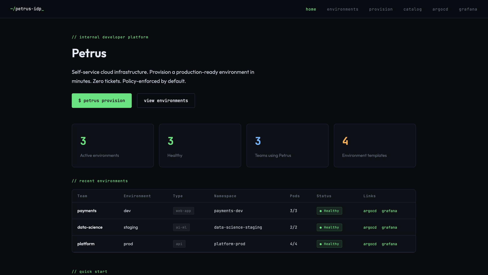
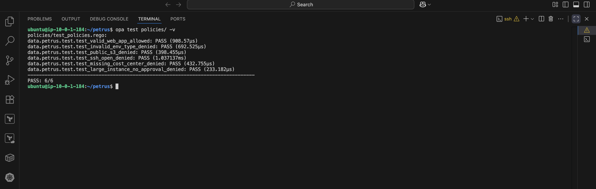
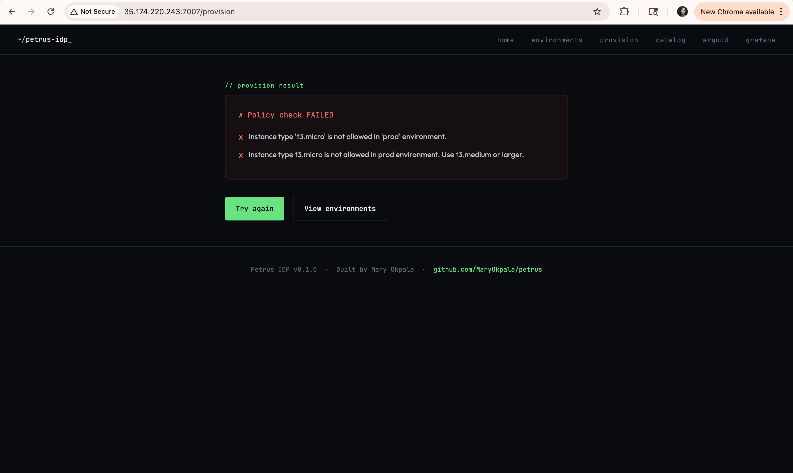
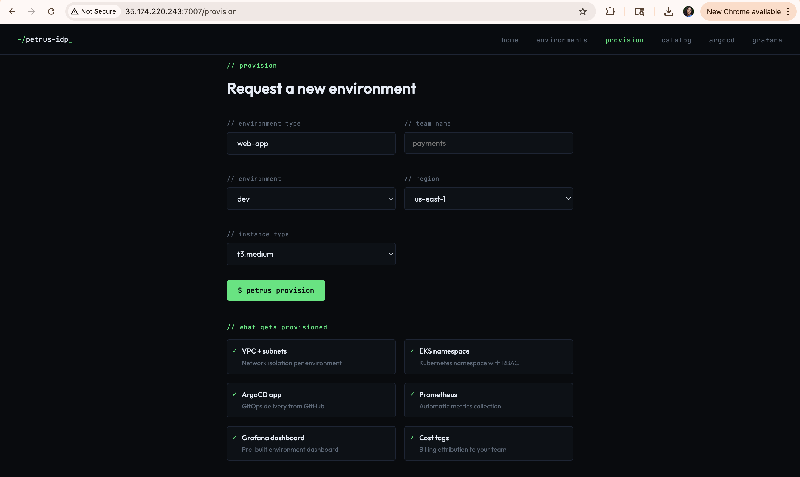
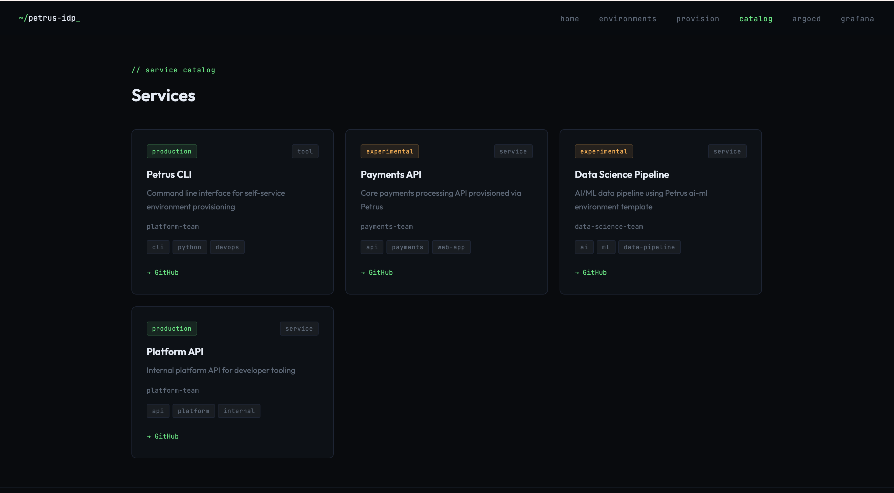

# Petrus — Internal Developer Platform

> A self-service cloud infrastructure platform that eliminates the bottleneck between development teams and platform engineering. Developers provision production-ready environments in minutes through a web portal or CLI. Every provisioning request is validated by an automated policy engine before any cloud resource is created.

---

## Executive Summary

Engineering organisations at scale face a common operational challenge: development teams depend on platform teams to provision infrastructure, creating a bottleneck that slows delivery, increases operational overhead, and introduces inconsistency across environments. Manual provisioning is error-prone, difficult to audit, and does not scale as organisations grow.

Petrus addresses this challenge by implementing an Internal Developer Platform (IDP) that separates the concerns of infrastructure definition from infrastructure consumption. Platform engineers define reusable environment templates, security policies, and cost guardrails once. Development teams consume these through a self-service interface without requiring platform team involvement for each request.

The result is a reduction in environment provisioning time from days to minutes, consistent infrastructure across all teams and environments, and automated enforcement of security and compliance requirements that previously relied on manual review.

---

## Problem Statement

| Challenge | Impact |
|-----------|--------|
| Manual environment provisioning | Days of wait time per request, platform team bottleneck |
| Inconsistent infrastructure | Environments diverge over time, incidents are hard to reproduce |
| Manual security reviews | Security policies are inconsistently applied or bypassed under delivery pressure |
| No cost attribution | Cloud spend is invisible until the monthly bill arrives |
| Knowledge concentration | Infrastructure knowledge lives with a small number of platform engineers |

---

## Solution Architecture

Petrus is designed as a layered platform with clear separation of concerns across four functional layers.


### Layer 1 — Developer Interface

Developers interact with Petrus through two interfaces depending on their workflow preference. The web portal provides a guided form-based experience for environment requests and service discovery. The Python CLI provides a programmatic interface suitable for scripting and automation workflows.

Both interfaces submit requests to the same policy evaluation and provisioning pipeline, ensuring consistent treatment regardless of the request origin.

### Layer 2 — Policy Enforcement

Every provisioning request — regardless of source — is evaluated by Open Policy Agent (OPA) before any infrastructure operation is initiated. OPA evaluates requests against three policy domains:

**Environment policies** govern which environment types, names, regions, and instance types are permitted. Instance type allowlists are defined per environment tier — a `t3.micro` that is acceptable in development is explicitly prohibited in production.

**Security policies** enforce baseline security controls that cannot be overridden: no publicly accessible S3 buckets, no unrestricted SSH access, mandatory VPC placement for all compute resources, encryption requirements for storage.

**Cost policies** enforce spend guardrails: per-team environment limits, approval requirements for large instance types, GPU instance restrictions to AI/ML environment types only, and mandatory cost attribution tags on all resources.

Requests that violate any policy are rejected with specific, actionable error messages before any cloud API call is made. There is no manual approval step — the policies are the approval.

### Layer 3 — Infrastructure Provisioning

Approved requests trigger modular Terraform provisioning. Each environment type maps to a composition of reusable Terraform modules:

- **Networking module** — VPC, public and private subnets, Internet Gateway, NAT Gateway, and route tables with correct isolation between tiers
- **Security module** — security groups with least-privilege ingress rules, IAM roles with scoped permissions, and instance profiles
- **EKS namespace module** — Kubernetes namespace with RBAC role bindings, resource quotas, and LimitRange objects
- **AI workload module** — S3 data lake with encryption and public access blocking, Glue catalog database, Athena workgroup, and scoped IAM roles for data processing

Remote state is stored in S3 with DynamoDB locking to prevent concurrent modifications and maintain a complete audit trail of infrastructure changes.

### Layer 4 — GitOps Delivery and Observability

Every provisioned environment is registered as an ArgoCD Application. Application workloads are deployed and managed declaratively through Git — the cluster state is continuously reconciled against the repository. Drift is detected and corrected automatically.

Prometheus and Grafana are deployed as platform-level services. Every new environment is automatically registered for metric collection through ServiceMonitor resources. PrometheusRule alerts are pre-configured for environment health, resource quota utilisation, pod restart rates, and cost anomalies.

---

## Platform Capabilities

### Self-Service Environment Provisioning

Developers provision complete, production-ready environments through the Petrus portal without requiring platform team involvement.



Each provisioning request captures the environment type, owning team, environment tier, target region, and compute requirements. The portal displays the full list of resources that will be provisioned, providing developers with transparency into what they are requesting before submission.

### Policy-as-Code Enforcement

Infrastructure governance is implemented as code, not process. Policies are version-controlled, testable, and applied consistently to every request.



The policy test suite validates all enforcement logic before deployment. The test results shown above confirm that valid requests are correctly approved, invalid environment types are rejected, public S3 buckets are blocked, unrestricted SSH access is denied, missing cost attribution tags are caught, and large instances without approval are prevented.



When a request violates policy, the platform returns specific, actionable error messages identifying the exact constraint that was not met. Developers receive immediate feedback without requiring manual review or back-and-forth communication with the platform team.

### Environment Request Form



The provision interface exposes the minimum required inputs to define an environment. Instance type options are constrained by environment tier — production tier requests do not surface development-only instance types. All required fields are validated before submission.

### Service Catalog



The service catalog provides a unified view of all services operating within the platform. Each entry captures the owning team, lifecycle status, service type, and repository link. The catalog serves as the single source of truth for service discovery across the organisation.

---

## Environment Templates

Petrus provides four pre-defined environment templates, each representing a different workload pattern:

| Template | Primary Use Case | Provisioned Resources |
|----------|-----------------|----------------------|
| `web-app` | Web applications and frontends | VPC · public/private subnets · EKS namespace · security groups · IAM roles |
| `api` | Backend API services | VPC · subnets · EKS namespace · RBAC · resource quotas |
| `data-pipeline` | ETL and data processing | VPC · S3 data lake · Glue catalog · Athena workgroup · Glue IAM role |
| `ai-ml` | Machine learning workloads | VPC · EKS namespace · S3 data lake · Glue · Athena · Redshift-ready · EMR-compatible |

All templates enforce consistent tagging including `team`, `environment`, `cost_center`, `project`, and `ManagedBy` tags on every provisioned resource.

---

## CLI Interface

The `petrus` CLI provides full platform access for developers who prefer terminal-based workflows or need to integrate environment provisioning into automated pipelines.

```bash
# Validate a request against policies without provisioning
petrus validate --type web-app --team payments --env prod --instance-type t3.micro

# FAILED — Instance type 't3.micro' is not allowed in 'prod' environment.

# Provision with a valid configuration
petrus provision --type web-app --team payments --env dev

# Provision an AI/ML environment
petrus provision --type ai-ml --team data-science --env staging

# Check environment status across all teams
petrus status

# Destroy an environment
petrus destroy --team payments --env dev
```

---

## Technology Stack

| Layer | Technology | Purpose |
|-------|------------|---------|
| Developer portal | Python · Flask | Self-service web interface |
| CLI | Python · Click · Rich | Terminal interface |
| Policy engine | Open Policy Agent (OPA) | Policy-as-code enforcement |
| Infrastructure provisioning | Terraform | Modular IaC with remote state |
| Configuration management | Ansible | Server configuration and hardening |
| Container orchestration | Kubernetes (k3s) | Workload management |
| GitOps | ArgoCD | Declarative application delivery |
| Package management | Helm | Kubernetes application packaging |
| Observability | Prometheus · Grafana · AlertManager | Platform and environment monitoring |
| Cloud | AWS (EC2 · EKS · S3 · Glue · Athena · IAM · VPC) | Target infrastructure |
| State management | S3 · DynamoDB | Terraform remote state and locking |

---

## Repository Structure

```
petrus/
├── cli/                        # Python CLI — provision, validate, status, destroy
│   └── petrus/
├── portal/                     # Flask developer portal
│   ├── app.py
│   └── templates/
├── terraform/
│   ├── modules/                # Reusable infrastructure modules
│   │   ├── networking/
│   │   ├── security/
│   │   ├── eks-namespace/
│   │   └── ai-workload/
│   ├── environments/           # Environment templates
│   │   ├── web-app/
│   │   ├── api/
│   │   ├── data-pipeline/
│   │   └── ai-ml/
│   └── backend/                # S3 state + DynamoDB locks
├── policies/                   # OPA policy rules and tests
│   ├── environments/
│   ├── security/
│   ├── cost/
│   └── test_policies.rego
├── argocd/                     # ArgoCD application manifests
├── monitoring/                 # Prometheus rules and ServiceMonitor
├── catalog/                    # Service catalog definitions
├── scripts/                    # Platform start/stop scripts
└── docs/                       # Architecture diagrams and runbook
```

---

## Getting Started

### Prerequisites

```
Python >= 3.9
Terraform >= 1.0
kubectl >= 1.28
Helm >= 3.0
OPA >= 0.60
AWS CLI >= 2.0 (configured with appropriate IAM permissions)
```

### Install the CLI

```bash
git clone https://github.com/MaryOkpala/petrus.git
cd petrus
pip install -e cli/
```

### Start the developer portal

```bash
cd portal
pip install -r requirements.txt
python3 app.py
# Portal available at http://localhost:7007
```

### Run policy tests

```bash
opa test policies/ -v
# Expected: PASS 6/6
```

### Provision your first environment

```bash
petrus provision --type web-app --team your-team --env dev
```

---

## Operational Runbook

See [docs/RUNBOOK.md](docs/RUNBOOK.md) for operational procedures including cluster health checks, environment management, service access details, and cost management guidance.

---

## Design Decisions

**OPA over custom validation logic.** Policy-as-code with OPA provides a testable, auditable, and version-controlled approach to governance. Policy changes go through the same code review process as infrastructure changes.

**Modular Terraform over monolithic templates.** Each environment type composes from shared modules rather than duplicating infrastructure definitions. Changes to networking or security propagate consistently across all environment types.

**Flask portal over Backstage.** A custom portal provides full control over the user experience and eliminates external dependencies on a complex JavaScript build toolchain. The portal is lightweight, deployable on minimal infrastructure, and directly integrated with the OPA policy engine.

**k3s over managed Kubernetes.** For a platform engineering demonstration and single-node workloads, k3s provides full Kubernetes API compatibility with significantly lower operational overhead than EKS or GKE.

---

*Built by [Mary Okpala](https://linkedin.com/in/mary-okpalaa) · [github.com/MaryOkpala](https://github.com/MaryOkpala)*
